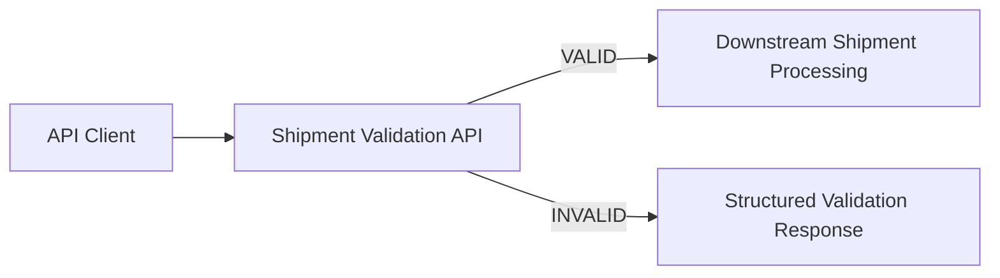

# Shipment Validation API Architecture Overview

Status: DRAFT_FOR_REVIEW

## Context

## Components

| Component | Responsibility |
|---|---|
| API Endpoint | Accept shipment validation requests |
| Request Model | Represent required shipment fields |
| Validation Service | Apply BR-001 through BR-006 |
| Response Model | Return status, correlation ID, and errors |
| Downstream Guard | Prevent invalid requests from continuing |

## Trust Boundary

All incoming requests are untrusted until validation succeeds.

## Design Constraints

- no production integration
- no customer data
- no persistent storage
- no autonomous deployment
- correlation ID required
