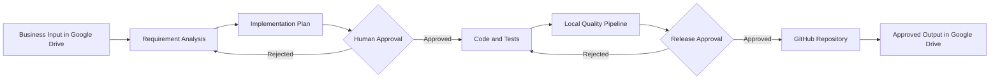

# 00 Vision

## Purpose

This section defines why the Heartbeat Agentic Delivery Demo exists, what problem it solves, what is in scope, and how success will be measured.

The demo is designed to prove that AI-assisted software delivery can be governed, traceable, repeatable, and safe. It does not attempt to create a fully autonomous software factory. It demonstrates a controlled delivery workflow in which AI agents perform bounded tasks, humans approve critical decisions, GitHub manages code and version history, and Google Drive manages business-facing source documents and approved outputs.

## Vision Statement

Create a governed, human-supervised AI engineering workflow for Heartbeat that converts approved business inputs into traceable plans, implementation artifacts, tested code, and operational documentation.

## Business Problem

Traditional delivery processes are slowed by:
- fragmented requirements and documentation
- inconsistent traceability between business need, design, code, and test evidence
- repeated manual preparation of plans, stories, test cases, and technical documents
- delayed reviews and unclear ownership
- inconsistent use of templates and engineering standards
- weak evidence at approval and release gates

The demo addresses these problems by introducing a documented and repeatable agent-assisted delivery lifecycle.

## Target Outcome

The demo must prove the following end-to-end path:

## Scope

### In Scope
- one demonstrable use case
- Claude Code as the AI engineering interface
- Google Drive for input and approved documents
- GitHub for code and version control
- local automation scripts
- Docker Compose for runtime
- human approval checkpoints
- automated tests and quality checks
- documentation as the primary source of truth

### Out of Scope
- autonomous production deployment
- direct production access for AI agents
- enterprise-scale identity integration
- full CI/CD through paid GitHub Actions
- production-grade observability platform
- unsupervised model training
- unrestricted access to business or customer data

## Demo Use Case

The reference scenario is a Shipment Validation API that:
- validates mandatory shipment fields
- validates positive shipment weight
- validates ISO country codes
- returns structured validation errors
- uses a correlation ID
- includes automated tests
- is packaged as a local Docker service

## Success Metrics

| Metric | Target |
|---|---:|
| Approved business input traced to generated artifacts | 100% |
| Human approval gates enforced before build and publish | 100% |
| Automated tests executed before publish | 100% |
| Code and documentation versioned in GitHub | 100% |
| Approved deliverables stored in Google Drive | 100% |
| Demo can run locally from documented steps | Yes |
| Manual editing required during demo | Minimal |

## Guiding Principles

1. Documentation before automation.
2. Human accountability before agent autonomy.
3. Traceability before speed.
4. Local reproducibility before cloud scale.
5. Approved inputs only.
6. No production deployment without explicit human authorization.
7. Every material decision must be recorded.
8. Every generated artifact must have an owner and status.

## Stakeholders

| Role | Responsibility |
|---|---|
| Technology Lead | Accountable for demo scope and technical direction |
| Domain Architect | Validates business and domain alignment |
| Integration Lead | Validates interfaces and technical integration |
| Data and Quality Lead | Validates data, testing, and evidence |
| Technical Delivery Manager | Owns plan, dependencies, readiness, and status |
| Security Reviewer | Reviews access, secrets, data handling, and threats |
| Business Approver | Confirms business intent and acceptance criteria |
| AI Agent | Produces bounded outputs under documented controls |

## Definition of Success

The demo is successful only if a reviewer can:
1. identify the original business input
2. see the generated analysis and plan
3. inspect the approval decision
4. review the generated code and tests
5. run the local quality checks
6. start the service locally
7. verify the GitHub history
8. locate the approved business output in Google Drive
