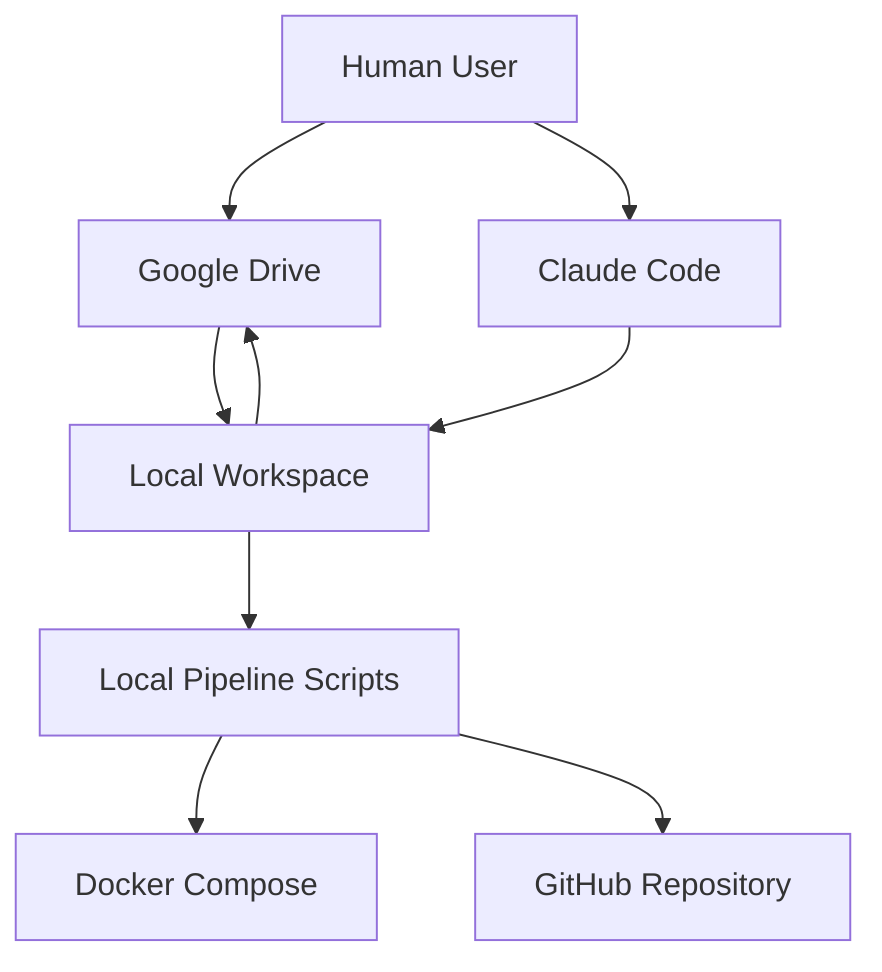
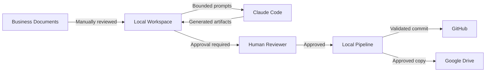
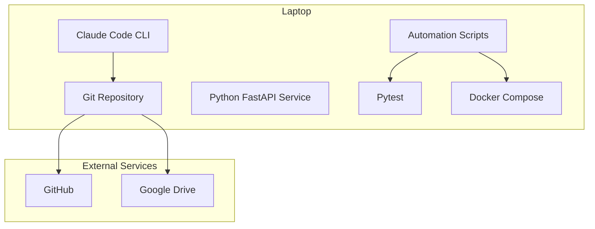

# 01 Architecture

## Architecture Objective

The architecture supports a local, governed AI-assisted delivery demo using:
- Claude Code
- Google Drive
- GitHub
- local scripts
- Docker Compose
- Python
- human approval files

## System Context

## Logical Components

| Component | Responsibility |
|---|---|
| Google Drive | Stores business input, review copies, and approved outputs |
| Claude Code | Executes bounded analysis, planning, coding, review, and documentation tasks |
| Local Workspace | Holds repository, prompts, source, tests, approvals, and generated outputs |
| Approval Files | Enforce explicit human decisions |
| Local Pipeline | Runs validation, tests, packaging, and publish controls |
| Docker Compose | Provides reproducible local runtime |
| GitHub | Stores source code, history, branches, pull requests, releases, and audit trail |

## Trust Boundaries

## Deployment View

## Data Flow

1. A business requirement is placed in Google Drive.
2. The document is copied into `input/`.
3. Claude Code reads the approved input and creates analysis artifacts.
4. A human reviews and updates the approval record.
5. Claude Code generates code and tests only when approval status is valid.
6. Local scripts run tests, syntax checks, and security checks.
7. A release approver authorizes publication.
8. Code is pushed to GitHub.
9. Approved documents are copied back to Google Drive.

## Key Design Decisions

| Decision | Rationale |
|---|---|
| Local scripts instead of GitHub Actions | Avoid paid CI dependency and keep the demo reproducible |
| Markdown approval records | Transparent, auditable, simple to demonstrate |
| GitHub for code | Strong version control and traceability |
| Google Drive for business artifacts | Familiar collaboration and controlled sharing |
| Docker Compose | Consistent runtime without infrastructure dependency |
| Single use case | Keeps the demo coherent and reduces failure points |
| No direct production integration | Limits risk and keeps scope suitable for a pilot |

## Non-Functional Requirements

### Security
- no secrets committed to source control
- `.env` excluded from Git
- least-privilege access
- no production data
- human approval before publish

### Reliability
- pipeline stops on failure
- deterministic scripts
- reproducible Docker build
- idempotent setup where possible

### Auditability
- every decision recorded
- every change committed
- every generated artifact versioned
- every approval names reviewer and date

### Maintainability
- simple folder structure
- small scripts
- clear ownership
- documented naming and branch rules

## Architecture Constraints

- laptop-based execution
- internet access required for GitHub, Google Drive, and Claude Code
- GitHub Actions not required
- Google Drive API integration optional
- manual file transfer acceptable for Phase 1
- only approved inputs may enter the workflow
