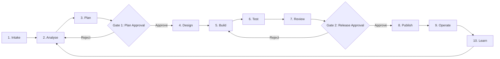
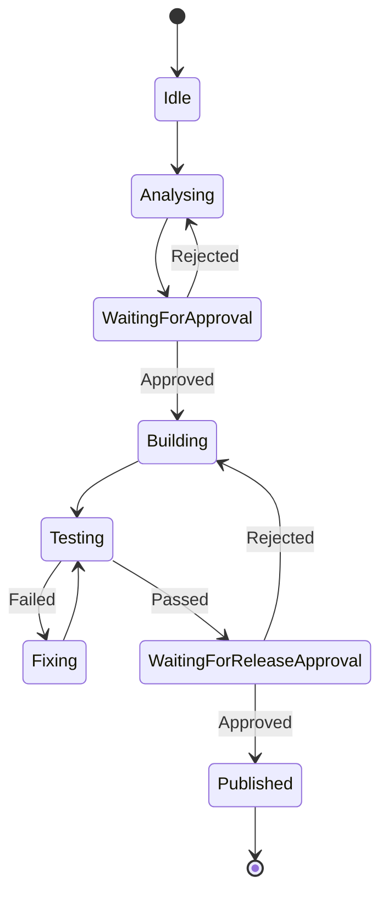

# 02 ADLC

## Agent Development Life Cycle

The ADLC defines how an idea becomes an approved, tested, documented, and releasable artifact.

## Lifecycle Stages

| Stage | Purpose | Primary Owner | AI Role | Human Role | Exit Criteria |
|---|---|---|---|---|---|
| Intake | Capture approved need | Business Owner | Summarize input | Confirm source and scope | Input registered |
| Analyse | Identify requirements, gaps, risks | Business Analyst / Architect | Draft analysis | Validate interpretation | Analysis accepted |
| Plan | Define delivery approach | Technical Lead | Draft plan and tasks | Approve scope and sequence | Plan approved |
| Design | Define architecture and interfaces | Architect | Propose design | Approve key decisions | Design accepted |
| Build | Create code and tests | Developer | Generate bounded changes | Review changes | Build complete |
| Test | Verify quality and behavior | QA Lead | Generate and run tests | Validate evidence | Tests passed |
| Review | Review code, security, and documents | Reviewers | Produce review findings | Accept or reject | No blocking findings |
| Publish | Commit, tag, and distribute | Release Owner | Prepare release package | Authorize publication | Release published |
| Operate | Run and monitor | Operations Owner | Assist with diagnostics | Own operational decisions | Stable operation |
| Learn | Capture lessons and improvements | Team | Summarize lessons | Approve updates | Documentation updated |

## Required Artifacts by Stage

| Stage | Required Artifacts |
|---|---|
| Intake | source document, intake record |
| Analyse | requirement summary, assumptions, open questions |
| Plan | implementation plan, task list, acceptance criteria |
| Design | architecture note, ADRs, interface definitions |
| Build | code, tests, build summary |
| Test | test report, defect log, evidence |
| Review | code review report, security review, documentation review |
| Publish | approval record, release notes, Git commit/tag |
| Operate | runbook, monitoring checklist, incident guide |
| Learn | lessons learned, backlog improvements |

## Agent States

## Gate 1: Plan Approval

Required checks:
- source document identified
- scope is explicit
- acceptance criteria are testable
- assumptions are listed
- risks are identified
- architecture impact is understood
- no coding starts before approval

## Gate 2: Release Approval

Required checks:
- code review complete
- automated tests passed
- no secrets detected
- documentation updated
- security review complete
- release notes prepared
- rollback method documented

## Failure Handling

| Failure | Required Response |
|---|---|
| Missing requirement | Stop and document gap |
| Ambiguous acceptance criteria | Escalate for clarification |
| Test failure | Block publish |
| Security issue | Block publish and raise finding |
| Approval missing | Stop workflow |
| Git push failure | Preserve local state and retry after correction |
| Google Drive upload failure | Keep approved artifact locally and record issue |

## Definition of Done

A work item is done only when:
- requirement traceability exists
- code is complete
- tests pass
- reviews are complete
- approvals are recorded
- documentation is updated
- release package is reproducible
- operational handover exists
