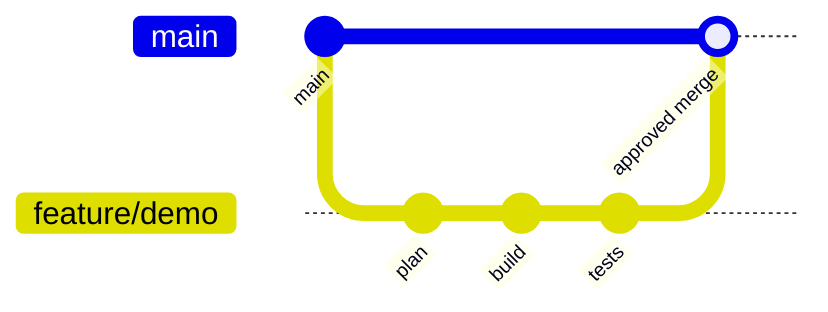

# 03 Repository

## Repository Structure

```text
heartbeat-agent-demo/
├── README.md
├── docs/
├── input/
├── output/
├── approvals/
├── src/
├── tests/
├── scripts/
├── prompts/
├── config/
├── .env.example
├── .gitignore
├── Dockerfile
├── docker-compose.yml
└── Makefile
```

## Folder Responsibilities

| Folder | Purpose | Owner |
|---|---|---|
| `docs/` | Single source of truth for process and standards | Technology Lead |
| `input/` | Approved source material | Business Owner |
| `output/` | Generated analysis and deliverables | Agent + Reviewer |
| `approvals/` | Human decisions and sign-offs | Approvers |
| `src/` | Application code | Development Lead |
| `tests/` | Automated tests | QA Lead |
| `scripts/` | Local automation and pipeline | DevOps / Engineering |
| `prompts/` | Versioned agent instructions | AI Engineering Owner |
| `config/` | Non-secret configuration | Engineering |
| `.env` | Local secrets, never committed | Local user |

## Branching Strategy



### Branch Types

| Branch | Purpose |
|---|---|
| `main` | Stable, approved code |
| `feature/<ticket>-<name>` | New feature work |
| `fix/<ticket>-<name>` | Bug fix |
| `docs/<ticket>-<name>` | Documentation change |
| `hotfix/<ticket>-<name>` | Urgent approved correction |

## Commit Standard

Use Conventional Commits:

```text
feat: add shipment validation endpoint
fix: reject zero shipment weight
test: add invalid country code coverage
docs: update approval workflow
chore: initialize demo repository
```

## Pull Request Requirements

Every pull request must include:
- purpose
- source requirement
- files changed
- test evidence
- risks
- screenshots or sample requests where relevant
- approval status
- rollback notes

## Merge Rules

- no direct push to `main`
- at least one human reviewer
- all local checks must pass
- approval file must show `APPROVED`
- unresolved security findings block merge
- documentation must be updated in the same change

## Versioning

Use semantic versioning:

```text
MAJOR.MINOR.PATCH
```

Example:
- `0.1.0` initial demo
- `0.2.0` new workflow capability
- `0.2.1` bug fix
- `1.0.0` approved pilot release

## Naming Standards

| Item | Standard | Example |
|---|---|---|
| Python file | snake_case | `shipment_validation.py` |
| Class | PascalCase | `ShipmentRequest` |
| Function | snake_case | `validate_weight()` |
| Environment variable | UPPER_SNAKE_CASE | `GITHUB_TOKEN` |
| Prompt file | numbered-kebab-case | `01-analyse-requirement.md` |
| Approval file | purpose-approval.md | `plan-approval.md` |

## Protected Files

The following must not be modified by an agent without explicit instruction:
- approval records
- security policy
- governance rules
- production configuration
- credentials
- branch protection settings
