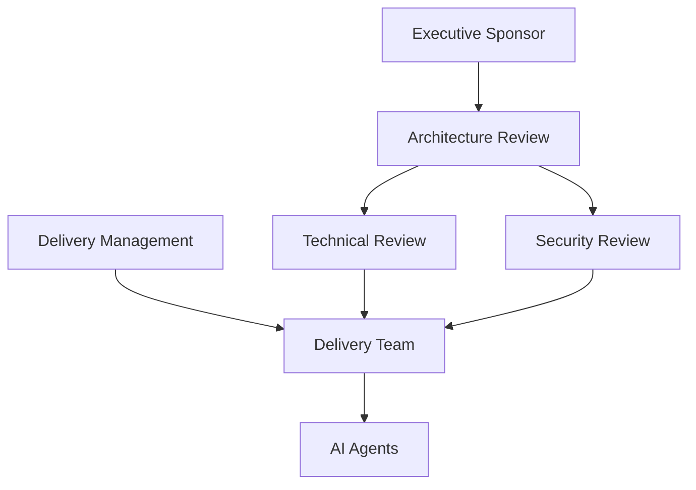

# 04 Governance

## Governance Objective

Governance ensures that AI accelerates delivery without removing human accountability.

## Governance Structure



## Decision Rights

| Decision | Accountable | Responsible | Consulted | Informed |
|---|---|---|---|---|
| Demo scope | Technology Lead | Delivery Manager | Business Owner, Architect | Team |
| Architecture | Architecture Lead | Solution Architect | Security, Integration, Data | Delivery |
| Business acceptance | Business Owner | Business Analyst | Architect, QA | Team |
| Code quality | Engineering Lead | Developer | QA, Reviewer | Delivery |
| Security approval | Security Lead | Security Reviewer | Architect, DevOps | Sponsor |
| Release approval | Release Owner | Delivery Manager | Engineering, QA, Security | Sponsor |
| Agent prompt changes | AI Engineering Owner | Prompt Author | Security, Architecture | Team |

## Governance Forums

### Architecture Review
Reviews:
- architecture changes
- data flows
- external integrations
- non-functional requirements
- ADRs
- exceptions

### Technical Review
Reviews:
- implementation readiness
- repository structure
- tests
- operational readiness
- code quality evidence

### Security Review
Reviews:
- secrets
- permissions
- data classification
- threat model
- dependency risks
- prompt injection risks

### Delivery Review
Reviews:
- plan
- milestones
- blockers
- approvals
- evidence
- readiness

## Architecture Decision Record Template

```markdown
# ADR-XXX: Decision Title

Status: Proposed / Accepted / Superseded
Date:
Owner:

## Context
## Decision
## Alternatives Considered
## Consequences
## Security Impact
## Cost Impact
## Approval
```

## Exception Process

1. Document the standard being violated.
2. Explain why compliance is not feasible.
3. Assess risk and impact.
4. Define compensating controls.
5. Set an expiry date.
6. Obtain named approval.
7. Track closure.

## Escalation Model

| Severity | Example | Escalation |
|---|---|---|
| Critical | security breach, secret exposure | immediate Technology Lead and Security Lead |
| High | release blocker, failed quality gate | same business day |
| Medium | requirement ambiguity, tooling issue | within two business days |
| Low | documentation improvement | backlog |

## Governance Evidence

The demo must retain:
- approval records
- Git history
- test results
- review findings
- ADRs
- release notes
- issue log
