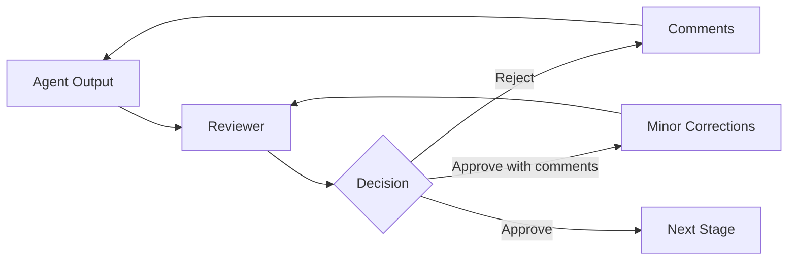

# 05 Human Approval

## Principle

AI agents may propose, analyse, draft, build, test, and review. Humans remain accountable for business intent, architecture, security, and release.

## Approval Flow



## Approval Types

| Approval | Required For | Approver |
|---|---|---|
| Input Approval | Confirm source is valid | Business Owner |
| Plan Approval | Authorize design and build | Technology Lead |
| Architecture Approval | Approve technical direction | Architect |
| Security Approval | Confirm controls are adequate | Security Reviewer |
| Code Approval | Accept implementation | Engineering Reviewer |
| Release Approval | Authorize publish | Release Owner |
| Business Acceptance | Confirm expected outcome | Business Owner |

## Approval Statuses

Only these statuses are valid:

```text
PENDING
APPROVED
APPROVED_WITH_COMMENTS
REJECTED
EXPIRED
```

## Plan Approval Template

```markdown
# Plan Approval

Status: PENDING
Reviewer:
Date:
Scope Reference:

## Reviewed Artifacts
- requirement summary
- implementation plan
- acceptance criteria
- risks and assumptions

## Checklist
- [ ] Scope is clear
- [ ] Acceptance criteria are testable
- [ ] Risks are understood
- [ ] Architecture impact is acceptable
- [ ] Security considerations are included
- [ ] Dependencies are identified

## Decision
## Comments
```

## Release Approval Template

```markdown
# Release Approval

Status: PENDING
Reviewer:
Date:
Version:

## Evidence
- [ ] Tests passed
- [ ] Code review completed
- [ ] Security review completed
- [ ] Documentation updated
- [ ] Rollback method documented
- [ ] No secrets committed

## Decision
## Comments
```

## Enforcement Rule

A script or agent must stop when:
- approval file does not exist
- status is not recognized
- status is `PENDING`
- status is `REJECTED`
- reviewer is blank
- date is blank
- required evidence is incomplete

## Separation of Duties

Where practical:
- author and approver should be different people
- security reviewer should not approve their own implementation
- release owner should verify evidence rather than rely on agent statements

## Emergency Change

Emergency changes still require:
- named owner
- reason
- impact
- minimal testing
- security check
- after-the-fact review within one business day
