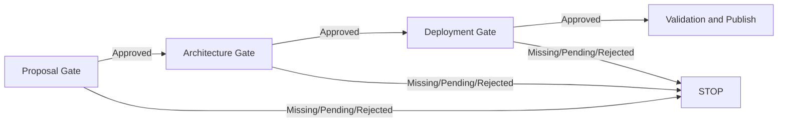

# 05 Human Approval

## Principle

Heartbeat governance is enforced through three machine-readable approval gates:

```text
Proposal Approval
        ↓
Architecture Approval
        ↓
Deployment Approval
```

The deterministic pipeline fails closed until each gate is approved.

## Approval Files

```text
approvals/
├── proposal.json
├── architecture.json
└── deployment.json
```

## Gate 1: Proposal

Confirms:

- business objective
- scope
- requirements
- acceptance criteria
- risks
- dependencies
- single-demo constraint

Responsible authority:

```text
Business Owner / Technology Lead
```

## Gate 2: Architecture

Confirms:

- proposal approval is valid
- architecture is documented
- interfaces and trust boundaries are understood
- security review is complete
- operational impacts are understood
- decisions and exceptions are recorded

Responsible authority:

```text
Architecture Review Authority
```

## Gate 3: Deployment

Confirms:

- proposal and architecture approvals are valid
- documentation and traceability checks passed
- QA and security evidence is complete
- local CI passed
- rollback is documented
- no secrets or restricted data are present

Responsible authority:

```text
Release / Deployment Authority
```

## Valid Statuses

```text
PENDING
APPROVED
APPROVED_WITH_CONDITIONS
REJECTED
EXPIRED
```

Only these statuses allow progression:

```text
APPROVED
APPROVED_WITH_CONDITIONS
```

Conditional approval must include at least one explicit condition.

## Required Approval Data

Every approval must include:

- gate
- status
- approver name
- approver role
- approval timestamp
- scope
- evidence checklist
- decision
- audit metadata

## Pipeline Behavior



## Approval Example

```json
{
  "gate": "proposal",
  "status": "APPROVED",
  "decision": "Proceed",
  "approver": {
    "name": "Named Human Approver",
    "role": "Technology Lead"
  },
  "approved_at": "2026-07-12T12:00:00+03:00",
  "evidence": [
    {
      "id": 1,
      "name": "Scope reviewed",
      "required": true,
      "verified": true
    }
  ]
}
```

## Separation of Duties

- an agent cannot approve a gate
- an author should not approve their own artifact
- architecture approval is separate from proposal approval
- deployment approval requires evidence, not verbal confirmation
- approvals are never inferred from successful automation
