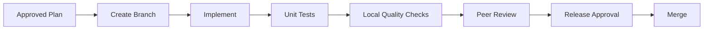

# 06 Development

## Development Workflow



## Local Prerequisites

- Git
- Python 3.12+
- Docker Desktop
- Docker Compose
- Claude Code
- GitHub account
- access to the demo Google Drive folder

## Setup

```bash
git clone <repository-url>
cd heartbeat-agent-demo
python -m venv .venv
source .venv/bin/activate
pip install -r requirements.txt
cp .env.example .env
```

Windows PowerShell:

```powershell
python -m venv .venv
.venv\Scripts\Activate.ps1
pip install -r requirements.txt
Copy-Item .env.example .env
```

## Coding Standards

- type hints required for public functions
- validation logic separated from API transport logic
- no hard-coded credentials
- clear error messages
- structured logging
- tests for positive and negative paths
- small functions
- explicit exception handling
- comments only where behavior is non-obvious

## Agent Development Rules

The development agent must:
1. read the approved plan
2. verify approval status
3. stay within scope
4. create or update tests
5. avoid editing governance or approvals
6. avoid introducing new dependencies without documenting them
7. produce a build summary
8. stop when a blocking ambiguity exists

## Testing Strategy

| Test Type | Purpose |
|---|---|
| Unit | Validate isolated business rules |
| Integration | Validate service and dependency interaction |
| API | Validate request and response contract |
| Negative | Validate failures and bad input |
| Security | Validate secrets, dependency, and basic misuse cases |
| Smoke | Confirm service starts and primary endpoint responds |

## Definition of Done

- code compiles
- tests pass
- no secret is present
- README updated
- approval evidence available
- release notes prepared
- Docker build succeeds
- API example tested

## Quality Script Expectations

The local quality script should run:
- formatting or linting
- syntax compilation
- unit tests
- dependency check where available
- secret scanning where available
- Docker build validation

## Prompt Standards

Every prompt should define:
- role
- objective
- allowed inputs
- expected outputs
- constraints
- stop conditions
- approval requirement
- file paths
- quality expectations

## Example Prompt Header

```markdown
Role: Development Agent
Objective: Build the approved shipment validation service.
Inputs:
- approved implementation plan
- acceptance criteria
Constraints:
- do not change approval files
- do not publish
Stop Conditions:
- approval missing
- requirement conflict
Outputs:
- code
- tests
- build summary
```
