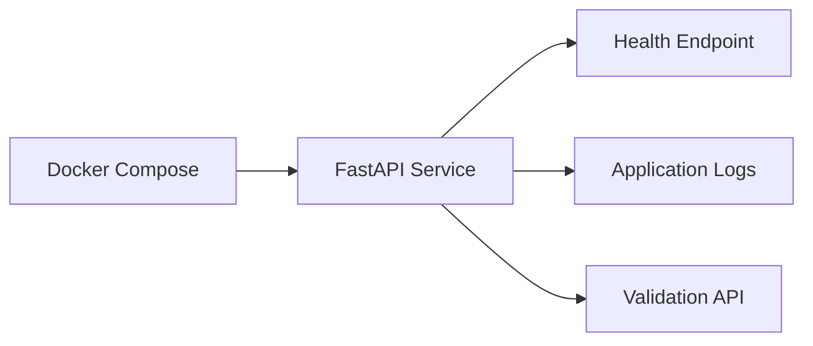
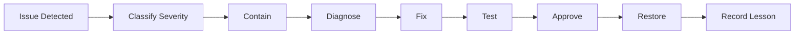

# 07 Operations

## Operations Objective

Ensure the demo can be started, observed, stopped, recovered, and supported consistently.

## Runtime Model



## Start

```bash
docker compose up --build
```

## Stop

```bash
docker compose down
```

## Health Check

```bash
curl http://localhost:8000/health
```

Expected:

```json
{"status":"ok"}
```

## Operational Checks

| Check | Expected Result |
|---|---|
| Container starts | healthy |
| `/health` responds | HTTP 200 |
| `/docs` loads | Swagger UI visible |
| valid request | accepted |
| invalid request | structured validation error |
| logs | correlation ID included |
| tests | all pass |

## Logging

Logs should contain:
- timestamp
- log level
- component
- correlation ID
- event
- error details where applicable

Logs must not contain:
- credentials
- tokens
- personal data
- full payloads unless explicitly approved

## Monitoring for Demo

Minimum metrics:
- request count
- validation failure count
- response status
- response time
- container health

## Incident Process



## Common Runbook Actions

### Service does not start
1. inspect container logs
2. check port conflict
3. check `.env`
4. rebuild image
5. run tests locally

### Tests fail
1. identify failing test
2. compare against approved acceptance criteria
3. correct code or test
4. rerun full suite
5. do not publish until green

### Git push fails
1. verify remote
2. verify authentication
3. pull latest changes
4. resolve conflict
5. rerun quality checks
6. push again

## Backup and Recovery

For the demo:
- GitHub is the code backup
- Google Drive is the business artifact backup
- local output may be regenerated
- approval records must be committed or archived

## Operational Handover Checklist

- [ ] startup documented
- [ ] shutdown documented
- [ ] health check documented
- [ ] known limitations listed
- [ ] support owner named
- [ ] rollback documented
- [ ] release version recorded
