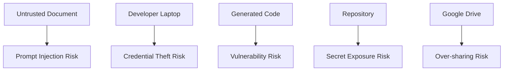

# 08 Security

## Security Objective

Protect business information, credentials, source code, and release integrity while using AI-assisted engineering.

## Security Principles

1. Least privilege.
2. No production credentials.
3. No customer data in the demo.
4. No secrets in prompts or repositories.
5. Human approval for sensitive actions.
6. Full traceability of generated changes.
7. Fail closed when approval or security evidence is missing.

## Threat Model



## Primary Threats and Controls

| Threat | Control |
|---|---|
| Prompt injection in source document | Treat documents as data, not instructions |
| Secret committed to Git | `.gitignore`, secret scan, human review |
| Over-permissioned Drive folder | restricted sharing and named users |
| Malicious dependency | dependency review and pinned versions |
| Unapproved code publish | approval file enforcement |
| Agent modifies governance | protected paths and review |
| Sensitive data in logs | structured redaction rules |
| Unauthorized repository access | private repository and branch protection |
| Code vulnerability | tests, review, dependency scan |

## Identity and Access

### GitHub
- private repository
- named collaborators
- MFA enabled
- branch protection
- least-privilege tokens

### Google Drive
- named users only
- no public links
- separate input, review, approved, and rejected folders
- review access based on role

### Local Machine
- full-disk encryption
- screen lock
- updated operating system
- credential manager
- no shared user account

## Secrets Management

Use `.env` for local secrets.

`.gitignore` must include:

```text
.env
*.key
*.pem
secrets/
credentials/
```

Never store:
- GitHub tokens
- Drive credentials
- API keys
- passwords
- private certificates

## Data Classification

| Classification | Demo Use |
|---|---|
| Public | allowed |
| Internal | allowed with access control |
| Confidential | use only when explicitly approved |
| Restricted / Customer Data | prohibited for Phase 1 demo |

## AI-Specific Controls

- prompts are versioned
- agents receive only required context
- outputs are reviewed
- external actions are bounded
- no autonomous publish
- generated code is treated as untrusted until tested
- source documents cannot override system rules

## Security Review Checklist

- [ ] no secrets
- [ ] dependencies reviewed
- [ ] no production data
- [ ] access limited
- [ ] input source trusted
- [ ] prompt injection considered
- [ ] logs exclude sensitive data
- [ ] release approval recorded
