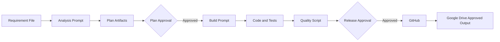

# 09 Examples

## Example 1: Shipment Validation API

### Business Requirement

Create an API that validates a shipment request.

Mandatory fields:
- customer account
- origin country
- destination country
- weight
- product type

Rules:
- weight must be greater than zero
- country codes must use ISO format
- errors must be structured
- every request must include a correlation ID

### Workflow



### Expected Files

```text
input/shipment-validation-requirement.md

output/
├── requirement-summary.md
├── implementation-plan.md
├── acceptance-criteria.md
├── risks-and-assumptions.md
└── build-summary.md

approvals/
├── plan-approval.md
└── code-approval.md

src/
├── main.py
├── models.py
└── validation.py

tests/
└── test_validation.py
```

### Example Valid Request

```json
{
  "customerAccount": "123456",
  "originCountry": "JO",
  "destinationCountry": "AE",
  "weight": 2.5,
  "productType": "EXPRESS",
  "correlationId": "demo-001"
}
```

### Example Invalid Request

```json
{
  "customerAccount": "",
  "originCountry": "JOR",
  "destinationCountry": "AE",
  "weight": 0,
  "productType": "EXPRESS",
  "correlationId": "demo-002"
}
```

### Expected Error Shape

```json
{
  "status": "INVALID",
  "correlationId": "demo-002",
  "errors": [
    {
      "field": "customerAccount",
      "code": "REQUIRED",
      "message": "customerAccount is required"
    },
    {
      "field": "originCountry",
      "code": "INVALID_COUNTRY_CODE",
      "message": "originCountry must be a two-letter ISO country code"
    },
    {
      "field": "weight",
      "code": "INVALID_WEIGHT",
      "message": "weight must be greater than zero"
    }
  ]
}
```

## Example 2: Rejected Plan

A reviewer identifies that:
- product type values are undefined
- maximum weight is unclear
- country code reference is not specified

Required result:
- plan status becomes `REJECTED`
- agent updates analysis
- no code is generated
- revised plan returns for review

## Example 3: Failed Test

A test shows zero weight is accepted.

Required result:
- quality pipeline fails
- publish script stops
- issue is corrected
- full test suite reruns
- release approval remains pending

## Demo Script

1. Open the input document in Google Drive.
2. Copy it to `input/`.
3. Run the analysis prompt.
4. Show generated plan files.
5. Approve the plan.
6. Run the build prompt.
7. Run local quality checks.
8. Start Docker Compose.
9. Test valid and invalid API requests.
10. Approve the release.
11. Push to GitHub.
12. copy approved outputs to Google Drive.
