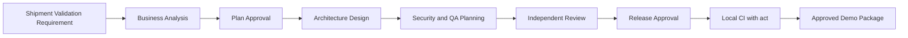

# 09 Example

## Shipment Validation API

This is the only demo scenario used in the repository.

The purpose is to demonstrate a governed, traceable, human-approved delivery flow from a business requirement to a release-ready technical package.

## Business Requirement

Create a Shipment Validation API that checks a shipment request before downstream processing.

Mandatory fields:

- customerAccount
- originCountry
- destinationCountry
- weight
- productType
- correlationId

Business rules:

- weight must be greater than zero
- origin and destination must be two-letter ISO country codes
- missing mandatory fields must return structured validation errors
- every response must return the original correlation ID
- invalid requests must not continue downstream

## End-to-End Flow



## Demo Files

```text
demo/shipment-validation-api/
├── README.md
├── runbook.md
├── input/
│   └── shipment-validation-requirement.md
├── approvals/
│   ├── plan-approval.md
│   └── release-approval.md
├── expected/
│   ├── requirement-summary.md
│   ├── architecture-overview.md
│   ├── test-plan.md
│   └── security-review.md
├── requests/
│   ├── valid-request.json
│   └── invalid-request.json
└── act/
    └── push-event.json
```

## Demo Rule

Do not introduce another use case into this repository.

Any future extension must deepen the Shipment Validation API scenario rather than add a second example.
